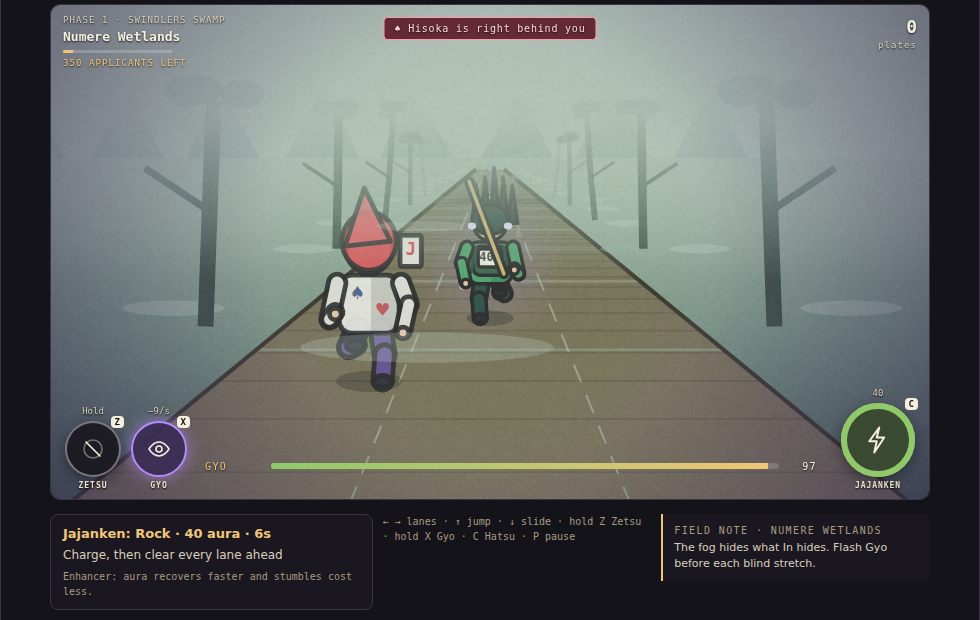

# Hunter × Hunter: Nen run

A behind-view, three-lane runner through the 287th Hunter Exam, drawn in pseudo-3D on a 2D canvas. It replaces the earlier 3D runner and the Santa Run-style platformer. The Temple Run shape stays; the depth comes from Nen and from the exam itself, the way Slime Crossing takes its skills from Tensura and Ghostbusters takes its tools from the films. On phones in portrait the canvas is 4:5 with a longer lens and a higher camera, so it is played the way Temple Run is played.

## What you play

Pick Gon, Killua, Kurapika, or Leorio, with their canonical applicant numbers. The exam is five stages across four phases of the actual course. Phase 1 is literally a long run behind Satotz, which is why the game is a runner at all.

| Phase | Stage | Length | What's different |
| --- | --- | ---: | --- |
| Phase 1 | Zaban Tunnel | 450 m | Other applicants (lane obstacles with number plates), collapsed applicants and luggage to jump, pipes to slide, pillars. Tonpa's juice is a trap pickup. Satotz runs ahead the whole way. |
| Phase 1 · second half | Numere Wetlands | 500 m | Fog shortens visibility. Many hazards are concealed with In and only readable through Gyo: logs, vines, a hippo's jaws, Noggin Luggers posing as applicants. Hisoka starts thinning the field. |
| Phase 2 | Visca Forest | 320 m | Buhara's Great Stamps lunge at whichever lane you are in. The stage ends at Split Mountain: the ravine is too wide for one jump, so you jump into a lane with a Spider Eagle egg hanging over it, catch it mid-air, and the updraft restarts your jump to the far side. One lane has no egg. |
| Phase 3 | Trick Tower | 500 m | MAJORITY doors that close two lanes, trapdoors, spike rows, swinging blades, hidden floors. The wall clock counts down 72 hours over the stage. Leroute's wager is a coin-flip pickup. |
| Phase 4 | Zevil Island | 550 m | Plates are scarcer and you need six points to pass. Your target's plate is worth three. Another applicant is hunting your plate. Bees, branches, boulders, ravines. |

Pass all four phases and the license is yours; the course then continues as Endless, a little faster each lap. Endless mode from the menu skips the rest cards and the Zevil quota. The verdict card lists the Hunter's notes that run produced, starring the ones nobody had found before.

## Nen is the depth

Aura is the one resource (100 max). The four controls on top of running are the four states of aura you actually use in the manga.

- **Ten** is default. Aura trickles back (4/s) and absorbs stumbles (25 aura each). With no aura, a stumble ends the run.
- **Zetsu** (hold Z) stops the aura flow. It recovers fast (14/s) and Hisoka loses your presence within about a second, but one hit of any kind ends the run and Gyo and Hatsu are unavailable.
- **Gyo** (hold X) focuses aura on the eyes. In-concealed hazards are invisible until about 13 m away unless Gyo is up. It costs 9 aura per second (half for Kurapika).
- **Hatsu** (C) is each character's technique, with a cost and a cooldown.

| Character | Type | Hatsu | Cost / recharge | Passive |
| --- | --- | --- | --- | --- |
| Gon #405 | Enhancer | Jajanken: Rock. Half a second of chant, then everything but gaps within 26 m, in every lane, is destroyed. | 40 / 6 s | Aura recovers 30 % faster; stumbles cost 20. |
| Killua #99 | Transmuter | Godspeed. For 3.5 s the body dodges on its own, using the same reflexes the solvability tests use. | 45 / 10 s | Tonpa's juice is harmless (Zoldyck poison training) and restores aura. Faster lane changes. |
| Kurapika #404 | Conjurer | Dowsing Chain. Seven seconds of free Gyo, with chains pointing at every hidden thing. | 30 / 9 s | Gyo costs half. |
| Leorio #403 | Emitter | Remote Punch. The next hazard in your lane, up to 42 m out, breaks 0.35 s later. | 18 / 4 s | Cheapest Hatsu and shortest recharge. |

**Hisoka** plays the Temple Run monkeys. From the wetlands on, a stumble puts him right behind you. A second stumble while he is there ends the run with his verdict. Nine seconds of clean running, or about a second of Zetsu, loses him.

## Easter eggs that are mechanics

- Tonpa's juice: a "FREE JUICE" tray in the tunnel. It costs 15 aura and cramps you for two seconds. Killua drinks it fine.
- Numbered plates: applicants wear random numbers, but famous ones turn up (405 Gon, 99 Killua, 404 Kurapika, 403 Leorio, 44 Hisoka, 16 Tonpa, 294 Hanzo, 301 Gittarackur, 53 Pokkle, 246 Ponzu, 118 Geretta, 191 Bodoro). Collected famous plates are kept in the notes.
- Your target on Zevil Island: Gon draws #44, as in the manga. The other targets are game assignments.
- Leroute's wager: half the time +5 points, half the time you lose fifty hours and thirty aura.
- Noggin Luggers: a Gyo reveal in the fog turns an "applicant" into an ape.
- Satotz's pace: run the whole tunnel without a stumble.
- Hunter's notes: sixteen discoveries, unlocked by doing the thing, plus the plate collection. Stored under `portfolio.hunter-nen-run.v4`.
- The head count: the HUD counts applicants left using the canon numbers (404 start, 371 finish the tunnel, 148 leave the swamp, 42 pass Phase 2, 25 leave the tower, 9 reach the final), interpolated over each stage.
- The tunnel ends on the long staircase, Satotz runs ahead for all of Phase 1, and a gate at every boundary names the next phase.

## Teaching and readability

The first collapsed applicant, pipe, and pillar of a first tunnel run carry JUMP, SLIDE, and SWITCH LANES labels, and the eggs over the ravine are labelled. In-concealed hazards shimmer only inside 9 m without Gyo, a little over half a second at wetlands speed, so Gyo is a real decision rather than a nicety. The runner leans into lane changes, squashes on landing with a puff of dust, and the camera bobs with the stride; speed lines appear under Godspeed.

## Controls

- ← / → or A / D change lanes (one more can be queued). ↑ / W / Space jumps. ↓ / S slides, or drops you out of a jump.
- Hold Z (or 1) for Zetsu, hold X (or 2) for Gyo, C (or 3) for Hatsu. P pauses. Switching tabs pauses.
- The three Nen techniques are round buttons inside the play area, the way mobile runners place abilities: Zetsu and Gyo bottom-left (hold), Hatsu bottom-right with a recharge ring. There are no on-screen arrows: swipe on the play area (left/right for lanes, up to jump, down to slide), or tap to jump. Held buttons use pointer capture and release on cancellation.
- Three challenges scale speed and recovery: Rookie (0.85×, 1.3× regen), Applicant, Pro Hunter (1.18×, 0.8× regen, more In).

## Art

Everything is drawn at runtime on the canvas; no image files are fetched or shipped, and no official artwork is used. The tunnel has a vaulted ceiling with an arch per bay and cones of lamplight reaching the floor; the tower has a beamed stone ceiling and torches that flicker. Far backdrops scroll with distance, clouds drift over the forest and the island, leaves fall and light shafts cross the forest, dust hangs in the corridors, fireflies blink in the swamp. A per-stage colour grade and a fine grain sit over the frame. The runner tucks in the air, tumbles on a knockout with a flash, carries Gon's backpack or Killua's skateboard, and Tonpa stands beside his juice tray with his #16 plate. The overlay cards carry small illustrations: the exam card, Netero's airship, the license, Hisoka's card, a cracked plate. The setup screen runs an attract loop of the tunnel behind the card. Characters and hazards are inked: every filled shape gets a dark outline scaled to its depth, limbs are round two-segment strokes with an ink underlay, and torsos carry a shadow side, which gives the cel-shaded anime read. Surfaces have perspective-correct detail: lamp and torch light pools and tile joints in the tunnel and tower, mortar lines on the walls, boardwalk planks over the swamp with water glints beside them, trodden earth with pebbles and grass tufts in the forest and on the island, a staircase at the end of the tunnel. The forest has layered broadleaf canopies and ferns, the island a sea behind its hills, the swamp drifting wisps. Aura motes rise around the runner in Ten, lightning in Godspeed, violet halos on what Gyo reveals, and an updraft of streaks when the egg catches you.

## Implementation

- `hunter-track.js`: stage data with canon head counts, hazard classes including charging pigs and the egg leap, hand-authored lane patterns per stage, seeded generation, coaching labels, famous plates.
- `hunter-model.js`: 120 Hz simulation. Lanes, jump and slide arcs, collision classes (low/high/gap/wall/soft/pickup), aura states, Hatsu, pursuer, stage progression, the Zevil quota, discoveries, and records. `autopilot()` is both Godspeed and the test pilot.
- `hunter-scene.js`: pseudo-3D projection (camera 8.5 m behind; the lens and camera height adapt to the canvas aspect so the runner sits in the lower third on both 16:9 and 4:5), stage backdrops and side scenery anchored to world distance, hazard art, two-segment-limb back-view runners, Satotz, Hisoka, phase gates, the staircase, fog wisps, In shimmer and Gyo halos, effects.
- `game-hunter.js`: setup, HUD, overlays (rest cards between phases, verdicts), keyboard and touch input, synthesized sound, records, arcade lifecycle, Hunter's notes.
- `hunter.css`: scoped desktop, phone portrait, phone landscape, and reduced-motion layouts.

No build step, no dependencies, no WebGL.

## Verified checks

`node --test tests/*.test.mjs` runs 53 tests across the arcade. The Hunter suite covers lane queueing, each collision class, stumble and Zetsu rules, aura economy for every state and passive, Hisoka's appearance, catch and escape, every Hatsu, plates and the target, rest cards, the Zevil quota and the license, deterministic generation, pause, storage safety, and records. The pilot drives every character at every difficulty through the whole exam, collecting the plates it needs and choosing an egg lane at the ravine, and Killua through three Endless laps. A 300-run sweep (4 characters × 3 difficulties × 25 seeds) passes with a single stumble. The forest has its own test for the pig lunge, the egg updraft, and the fall without one.

Browser checks with Playwright cover keyboard lanes, jump, slide, Zetsu and Gyo holds, pause, a scripted stumble summoning Hisoka and a second one ending the run, retry, records, guide and modal pausing, selection persistence across reload, touch swipes, held on-canvas Nen buttons, and reduced motion, at 1280×900, 390×844, and 844×390. Screenshots of each stage, the leap, the verdict card, and both phone orientations were inspected.

