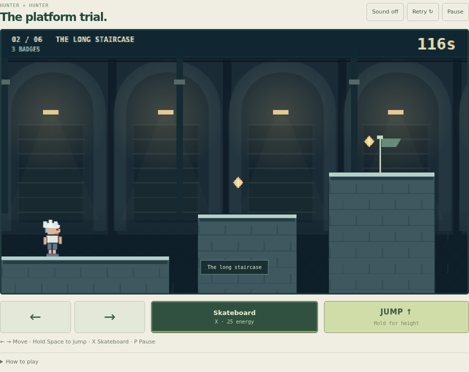

# Hunter × Hunter: The platform trial

A manually controlled 2D platformer in the hidden portfolio arcade. The user chose **Santa Run-style platforming** after rejecting both the 3D runner and a flat side-scrolling auto-runner. The replacement therefore changes the actual movement, terrain, and failure loop.

## What you play

Choose Killua, Gon, Kurapika, or Hisoka. Pick Hunter Exam, Yorknew City, or Greed Island. Trial is the default and has six authored rooms per course, for eighteen distinct layouts. Reach the yellow exit in each room before the shared countdown expires. Rooms progress immediately after a short clear animation.

You control horizontal movement and can stop, reverse, or steer in the air. Holding Jump gives a high jump; tapping gives a short hop. There is a small grace period after leaving a ledge and input buffering just before landing. Thin ledges are one-way platforms that can be jumped through from below; full-height terrain and wooden crates are solid.

| Course | Six rooms |
| --- | --- |
| Hunter Exam | The entrance; The long staircase; Broken passage; A higher path; Over the wetlands; Follow the examiner |
| Yorknew | Auction district; Fire escape; Old rooftops; Across the avenue; Service lifts; Backstreet exit |
| Greed Island | Out of the village; Rocky ascent; Fragile stepping stones; The shortcut; Drifting stone; Road to Masadora |

The rooms include height changes, gaps, optional upper routes, badges, cracked platforms that crumble, moving platforms that carry the player, spikes, crates, and occasional patrolling sentries. Green checkpoint flags save your position. Falling or hitting a hazard returns you to the flag in 0.35 seconds and deducts a few seconds. Collected badges stay collected. No ability is required to finish.

## Modes and challenge

| Challenge | Initial time | Mistake penalty | Aura/stamina recovery |
| --- | --- | --- | --- |
| Rookie | 120 seconds | 2 seconds | 5 per second |
| Hunter | 95 seconds | 3 seconds | 3.5 per second |
| Veteran | 75 seconds | 4 seconds | 2.5 per second |

The clock starts with the first movement, jump, or power input. It pauses when the game is paused or hidden and during room-clear transitions. Difficulty changes the time and resource budget while preserving familiar movement physics.

Endless is a separate selection. It continues through the authored room set in a rotating order and grants 18 seconds per exit, capped at the challenge's initial time. It has no final room count. Only the current room's terrain and objects are retained. It is a survival sequence of designed rooms, not an infinitely unique generated map.

Records use `portfolio.hunter-platformer.v3` because scores from the earlier runners are not comparable. Records are separated by character, course, difficulty, and mode. Trial remains the default on reload.

## Controls

- Left / Right or A / D: move; release to brake.
- Space / Up / W: jump; hold for height, release for a short hop.
- X or 3: optional character action.
- P: pause/resume. R or Retry: return to your checkpoint, with the normal retry penalty.
- Phone: hold a direction with one thumb and Jump with the other. Pointer capture supports simultaneous held inputs and releases them on cancellation, blur, or closing.

The selector is outside the gameplay view. Once started, the screen emphasizes the map, room number, time, and four touch controls. The same logical view is used across viewport sizes. Landscape retains visible pause and retry buttons. Sound is optional and synthesized locally; reduced motion disables decorative effects.

## Character actions

| Character | Exam Trial | Yorknew Trial | Greed Island Trial | Endless |
| --- | --- | --- | --- | --- |
| Killua | Skateboard ground dash | Rhythm Echo dash | Lightning Palm stuns a nearby sentry | Godspeed dash with one sentry deflection |
| Gon | Fishing rod retrieves a nearby badge | Fishing rod | Jajanken: Rock charges and breaks a nearby crate | Jajanken: Rock |
| Kurapika | Twin blades cut a nearby crate | Dowsing Chain holds off a nearby sentry | Dowsing Chain | Dowsing Chain |
| Hisoka | Bungee Gum pulls toward a visible anchor | Bungee Gum | Bungee Gum | Bungee Gum |

Actions are optional shortcuts or assists, not the movement foundation. Their button states specify the missing target or cooldown. Jajanken has a charge delay; Bungee Gum gives a visible tether and physical aerial impulse; ground dashes still require steering and jumping. Electricity does not regenerate by waiting: entering the next room supplies 30 charge. Other energy regenerates gradually. No Chain Jail against ordinary enemies, and no trained Nen for early Exam Gon/Killua/Kurapika.

These are deliberately limited arcade adaptations, not full simulations of canonical powers. The backgrounds are original pixel-style interpretations rather than exact episode geography. Platforms, pickups, crates, and sentries are game inventions.

## Implementation

- `hunter-levels.js`: eighteen authored maps, checkpoints, hazards, badges, and anchors.
- `hunter-model.js`: 120 Hz movement, solid and one-way collisions, moving/crumbling surfaces, room progression, checkpoints, countdowns, powers, and records.
- `hunter-scene.js`: original Canvas 2D sprites and layered setting art, with platforms drawn at the collision geometry.
- `game-hunter.js`: manual held-key/multi-pointer input, lifecycle, selector, controls, and HUD.
- `hunter.css`: scoped responsive interface.

There is no WebGL dependency, automatic horizontal movement, slide button, or flat-track obstacle generator.

## Verified checks

Run `node --test tests/*.test.mjs`.

The 55-test arcade suite includes manual start/stop/reverse, variable jump height and air control, coyote time and jump buffering, solid/one-way surfaces, checkpoint recovery, moving/crumbling platforms, timer expiry, pause, abilities, and validated records. All 36 character/course/difficulty combinations complete their six authored rooms without using powers. A 40-room Endless simulation verifies continued progression and bounded level storage.

Browser verification uses keyboard input with controlled browser-clock advancement for an entire six-room Exam Trial, plus a native simultaneous two-thumb touch run through its first room. It checks no auto-run before input, braking and reversing, pause/reopen, records, default mode, pointer release, modal close, and control visibility at 1280×960, 390×844, 320×568, and 844×390. Screenshots are visually inspected. Model tests alone do not establish enjoyable play.

## Design references

- [60 Second Santa Run on Coolmath Games](https://www.coolmathgames.com/0-60-second-santa-run): manual run/jump controls, a destination, and time pressure.
- [Santa Run 2](https://www.coolmathgames.com/0-santa-run-2): compact platforming, hazards, and quick retries.
- [Run](https://www.coolmathgames.com/0-run): short course progression and spatial route reading. The user explicitly chose the Santa Run-style 2D direction over a Run-style tunnel.
- Original setting research: [NTV character profiles](https://www.ntv.co.jp/hunterhunter/character/) and [official dictionary](https://www.ntv.co.jp/hunterhunter/dictionary/).

