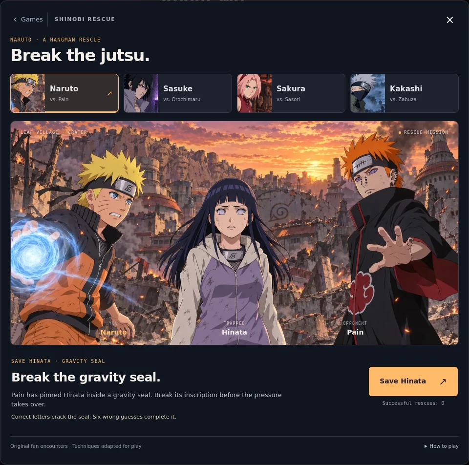
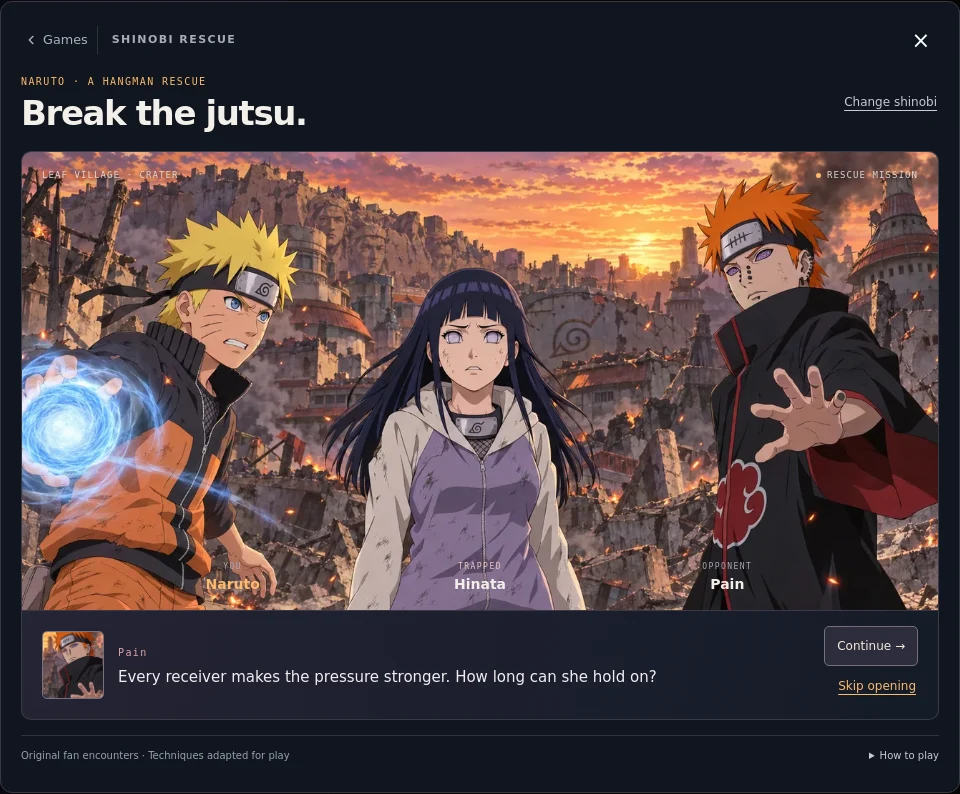
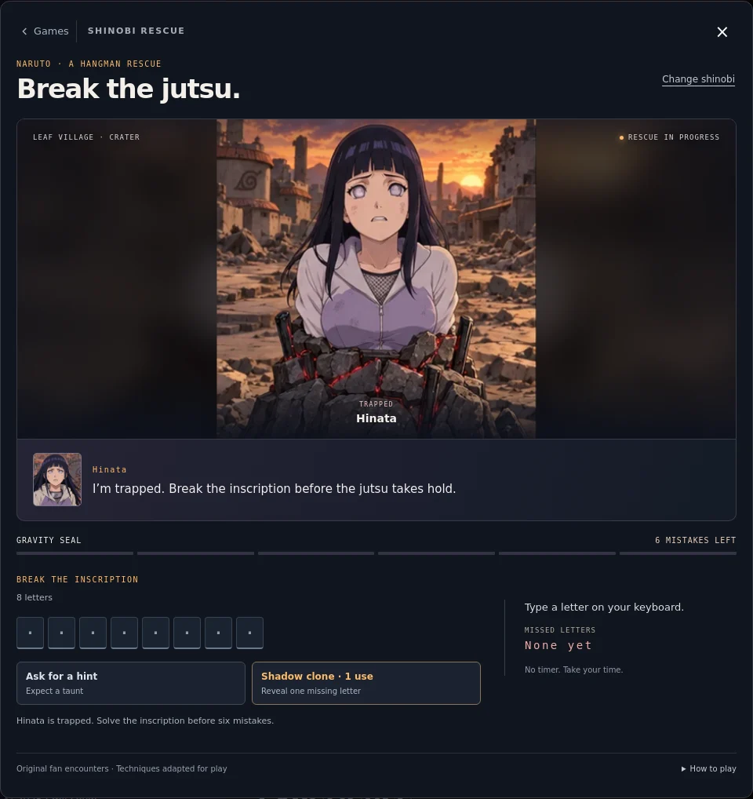
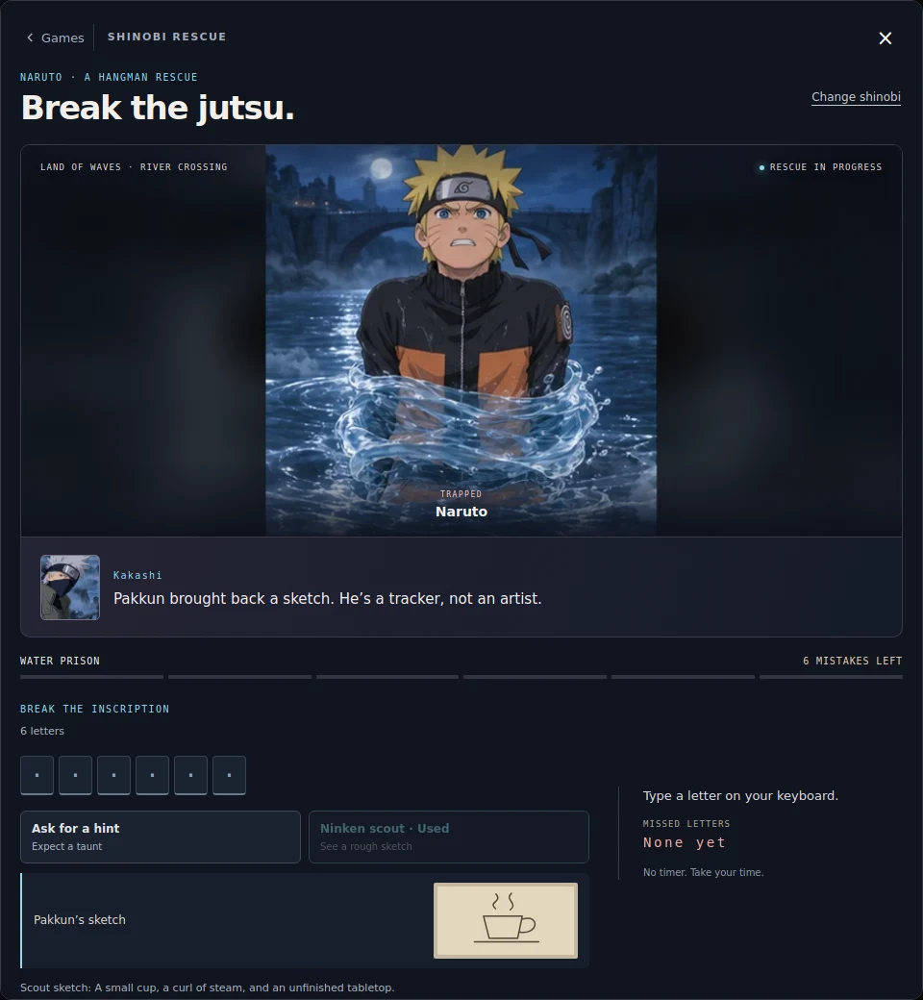
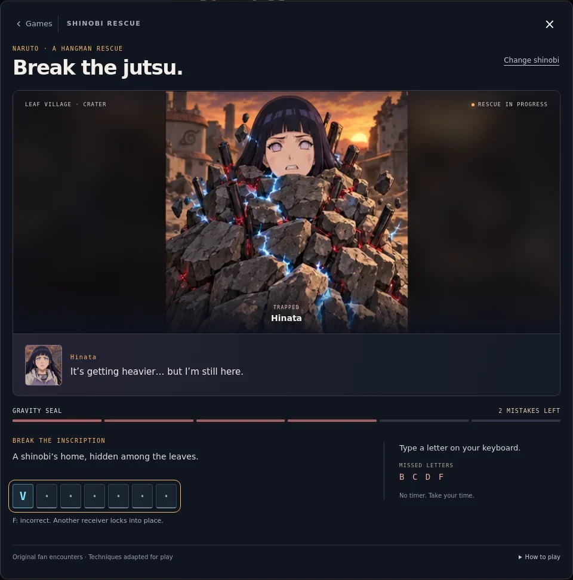
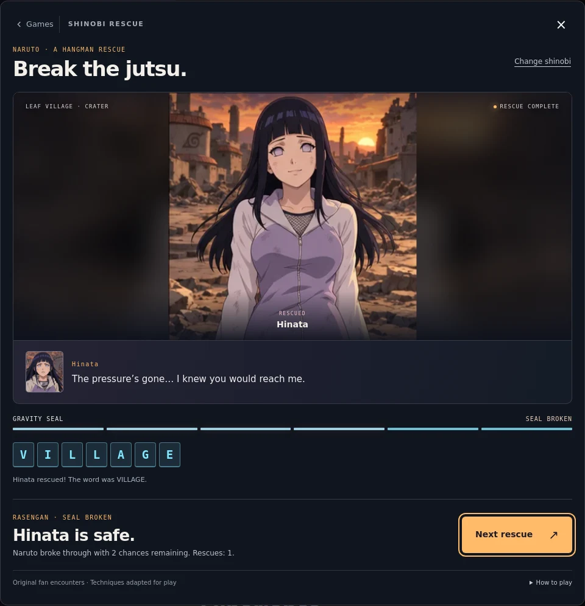
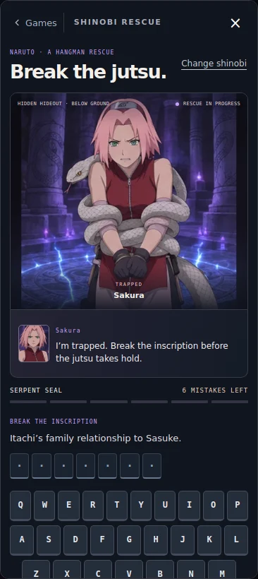

# Shinobi Rescue

A Naruto-inspired hangman game inside the portfolio's existing mini-game arcade. Open the arcade from the sidebar footer and choose **Shinobi Rescue**.

Selecting a shinobi selects an entire original fan encounter, including the opponent, captive, scenery, restraint, attack, UI colors, and one-use ability. Every hero uses the same mixed word pool. Techniques are adapted for the game rather than presented as recreations of canonical fights.

| Playable shinobi | Opponent | Captive | Restraint | Finishing technique |
| --- | --- | --- | --- | --- |
| Naruto | Pain | Hinata | Gravity field and receivers | Rasengan |
| Sasuke | Orochimaru | Sakura | Serpent coils | Chidori |
| Sakura | Sasori | Kankuro | Puppet frame and threads | Chakra strike |
| Kakashi | Zabuza | Naruto | Water prison | Lightning blade |

## Play

Guess letters with only the word length visible. Clues remain absent from the UI until **Ask for a hint** is pressed. The clue then stays visible and the opponent delivers a character-specific taunt. Asking costs no mistake and does not consume the hero's ability; the hint button is spent for that word.

Each character has a separate ability, usable once per rescue:

| Hero | Ability | Effect |
| --- | --- | --- |
| Naruto | Shadow clone | Reveals one unguessed correct letter and all its occurrences. Can complete the rescue. |
| Sasuke | Sharingan | Rules out three unused wrong letters. These are blocked for both physical typing and touch, without spending mistakes. |
| Sakura | Careful analysis | Reveals a vague association, distinct from the requested clue. |
| Kakashi | Ninken scout | Reveals a small, deliberately ambiguous ink sketch with an equivalent accessible description. |

Ability results remain visible through subsequent guesses and after resuming. Changing selection or closing the arcade does not recharge an ability. Starting a new word resets both help actions. Neither action can be used after winning or losing.

Laptops and desktops use physical typing by default, with a compact missed-letter history instead of on-screen keys. Touch devices retain the on-screen keys. An optional key toggle in How to play supports desktop users who need clickable controls. Detection uses hover/pointer capability, not viewport width; narrowing a desktop window does not bring the keyboard back. Correct guesses reveal every occurrence of the letter and leave persistent cracks in the prison. Wrong guesses advance the mission-specific restraint; six distinct misses complete the jutsu. Guessing a previously used or ruled-out letter costs nothing. There is no timer.

Each mission begins with a skippable, three-speaker opening over the group illustration. Gameplay then cuts to a close-up of the captive. The restraint is part of the generated illustration: stone anchors, snakes, a wooden puppet frame, or a water prison. Three threat levels and three damage levels combine independently, so mistakes never erase earned damage. Correct guesses advance from intact to weakened to breaking; completing the word reveals a freed portrait. Failure shows the completed restraint, reveals the answer, and offers another word. These are changing illustrated stills with brief transitions, not animated 3D characters.

Hero, captive, and villain dialogue reacts to guesses and results. After 18 seconds without a guess, an occasional line keeps the scene alive; at most two lines play per thinking pause. Dialogue pauses when the arcade closes or the tab loses visibility, never advances a countdown, and stops at the ending. Previously seen openings are skipped on the next rescue within the session.

The pool contains 64 words: 56 everyday words spanning food, nature, objects, travel, music, and ideas, plus eight Naruto terms. Each mission shuffles this same pool into its own bag, with no repeats until all 64 are played and no consecutive repeat across bag boundaries. Every word has a requested clue, a separate vague association, and an associated sketch. Drawings intentionally overlap across related words so they suggest a direction rather than label the answer.

Changing shinobi opens the mission selector. Resume returns to the previous mission with guesses intact; starting the selected mission begins a fresh word. Closing and reopening the arcade also preserves the in-memory round. Per-hero rescue counts persist locally when storage is available. Reloading the page starts a new session; an active word is not persisted.

## Implementation

- `js/rescue-model.js`: encounter definitions, shuffled decks, pure guess state, hints, and one-use ability rules.
- `js/rescue-words.js`: shared mixed word pool and character ability definitions.
- `js/rescue-sketches.js`: small code-native ink sketches used only as optional clues; these do not replace or overlay the character/binding art.
- `js/rescue-art.js`: opening/captive compositions, sprite frame selection, and retriable artwork preloading.
- `js/rescue-story.js`: original encounter dialogue and independent threat/damage frame mapping.
- `images/shinobi/*.webp`: four group illustrations and four twelve-frame victim sheets, bundled locally. Selection and dialogue portraits crop the group illustrations.
- `docs/shinobi-art-prompts.json`: exact generation prompts, asset paths, and built-in tool provenance.
- `js/game-rescue.js`: UI, keyboard handling, arcade lifecycle, short effect timers, and optional record storage.
- `css/rescue.css`: scoped responsive layouts, character themes, feedback animations, and reduced-motion treatment.
- `index.html` / `js/game-arcade.js`: one picker card, panel, stylesheet, and controller registration.

The vector characters and SVG restraint overlays have been removed. All eight WebP artwork files total about 1.84 MiB. Only the selected mission's victim sheet is preloaded, and gameplay waits for it to decode. If it fails, the player can retry without starting an invisible round. Asset URLs support a project subpath such as GitHub Pages. There are no remote artwork dependencies, new runtime dependencies, or build step. Other games' implementation files are unchanged. No continuous JavaScript animation loop; effects and dialogue use canceled-on-close timers. Screen readers receive guess outcomes, word progress, and dialogue through live regions. The scene also has a state-aware accessible description.

## Validation

Run the model regression suite from the repository root:

```sh
node --test tests/*.test.mjs
```

69 tests pass, including sixteen rescue tests covering all 64 words, duplicate/invalid input, the six-miss limit, last-chance wins, terminal-state locks, reset behavior, shuffled-deck boundaries, damage preservation, endings, dialogue, hint gating, all four abilities, letter exclusions, ability-assisted wins, and complete sketch/association coverage.

Scripted Chromium browser checks passed:

- Every mission's roles, persistent damage, duplicate protection, last-chance win, and freed ending artwork.
- Desktop physical-keyboard loss, answer reveal, and post-result input lock.
- Touch-device tapping and loss; readable word tiles at 320, 390, and 768 pixels.
- Hidden desktop letter keys, correct focus on the word, and the optional accessibility toggle.
- All eight local art files decode; computed gameplay background URLs work under a project subpath.
- Three-speaker opening, skipped opening, ignored gameplay input during the opening, and automatic skip on replay.
- Idle dialogue stops after two lines, resets after a guess, pauses while closed, and stops on a result.
- Failed artwork loading leaves a working retry instead of starting gameplay.
- Selecting another hero and resuming the original rescue.
- Closing/reopening, focus restoration, and no guesses accepted while hidden.
- No horizontal overflow in selection or play at 320, 390, 768, and 1280 pixels.
- Reduced motion disables animation while preserving gameplay and results.
- All five previous arcade games still open and return to the picker.
- Initialization with local storage blocked.
- No JavaScript page errors during the main browser pass.
- Additional help-flow browser checks: clues stay absent before request, abilities do not reveal the main clue, every opponent taunts, ability results survive selection changes and close/reopen, new rounds reset help, and a last-chance clone win updates the ending and rescue count exactly once.
- Touch hints, abilities, and letter taps; both touch and desktop layouts stay within the modal width at 320, 390, and 768 pixels.

Screenshots were visually inspected on desktop and phone layouts. Safari and physical devices have not been tested.














