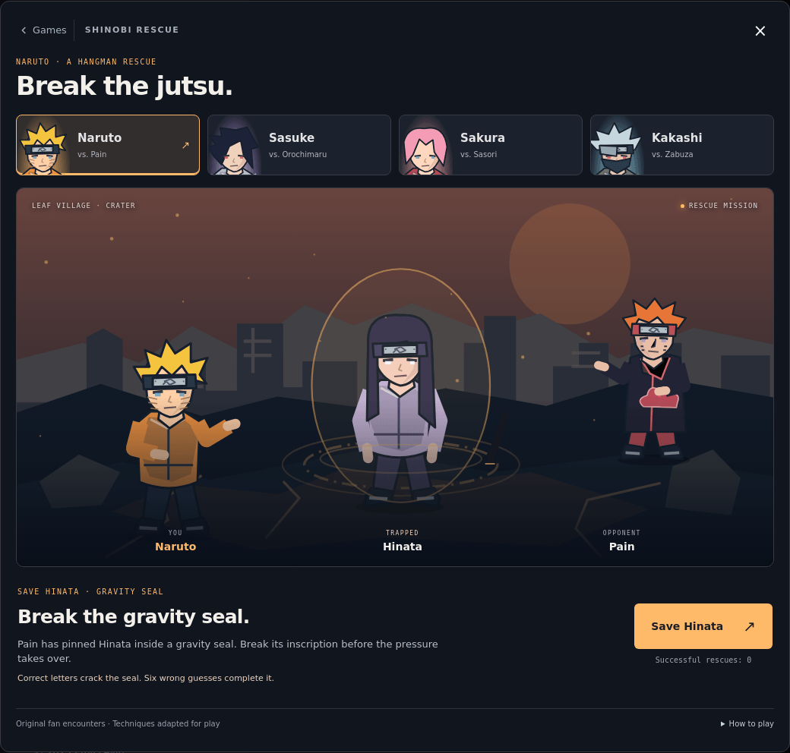
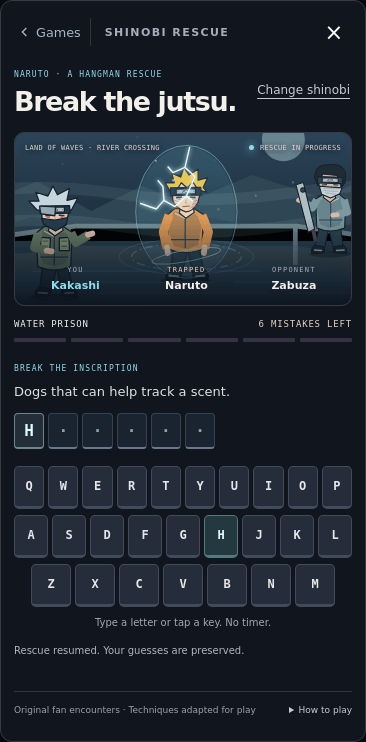

# Shinobi Rescue

A Naruto-inspired hangman game inside the portfolio's existing mini-game arcade. Open the arcade from the sidebar footer and choose **Shinobi Rescue**.

Selecting a shinobi selects an entire original fan encounter, including the opponent, captive, scenery, restraint, attack, UI colors, and clue pool. Techniques are adapted for the game rather than presented as recreations of canonical fights.

| Playable shinobi | Opponent | Captive | Restraint | Finishing technique |
| --- | --- | --- | --- | --- |
| Naruto | Pain | Hinata | Gravity field and receivers | Rasengan |
| Sasuke | Orochimaru | Sakura | Serpent coils | Chidori |
| Sakura | Sasori | Kankuro | Puppet frame and threads | Chakra strike |
| Kakashi | Zabuza | Naruto | Water prison | Lightning blade |

## Play

Read the clue and guess letters using a physical keyboard or the on-screen keys. Correct guesses reveal every occurrence of the letter and leave persistent cracks in the prison. Wrong guesses advance the mission-specific restraint; six distinct misses complete the jutsu. Guessing a previously used letter costs nothing. There is no timer.

Completing the word triggers the hero's attack, a shattering prison, and a rescued character. Failure reveals the answer and offers another word. Each mission has twelve curated clues in a shuffled bag with no repeat until the bag is exhausted, including protection against repeats across bag boundaries.

Changing shinobi opens the mission selector. Resume returns to the previous mission with guesses intact; starting the selected mission begins a fresh word. Closing and reopening the arcade also preserves the in-memory round. Per-hero rescue counts persist locally when storage is available. Reloading the page starts a new session; an active word is not persisted.

## Implementation

- `js/rescue-model.js`: encounter definitions, clue decks, and pure guess state.
- `js/rescue-art.js`: original inline vector characters, four environments, restraints, and crack geometry. No external image requests.
- `js/game-rescue.js`: UI, keyboard handling, arcade lifecycle, short effect timers, and optional record storage.
- `css/rescue.css`: scoped responsive layouts, character themes, feedback animations, and reduced-motion treatment.
- `index.html` / `js/game-arcade.js`: one picker card, panel, stylesheet, and controller registration.

No new runtime dependencies or build step. Other games' implementation files are unchanged. No continuous JavaScript animation loop; effects use CSS plus short, canceled-on-close timers. Screen readers receive guess outcomes and word progress through a live region. The scene also has a state-aware accessible description.

## Validation

Run the model regression suite from the repository root:

```sh
node --test tests/*.test.mjs tests/hunter.test.mjs
```

59 tests pass, including six new rescue tests covering all 48 clues, duplicate/invalid input, the six-miss limit, last-chance wins, terminal-state locks, reset behavior, and shuffled-deck boundaries.

Scripted Chromium browser checks passed:

- Every mission's roles, persistent cracks, duplicate protection, last-chance win, and final prison disappearance.
- On-screen-key loss, answer reveal, and post-result input lock.
- Selecting another hero and resuming the original rescue.
- Closing/reopening, focus restoration, and no guesses accepted while hidden.
- No horizontal overflow in selection or play at 320, 390, 768, and 1280 pixels.
- Reduced motion disables animation while preserving gameplay and results.
- All five previous arcade games still open and return to the picker.
- Initialization with local storage blocked.
- No JavaScript page errors during the main browser pass.

Screenshots were visually inspected on desktop and phone layouts. Safari and physical devices have not been tested.




